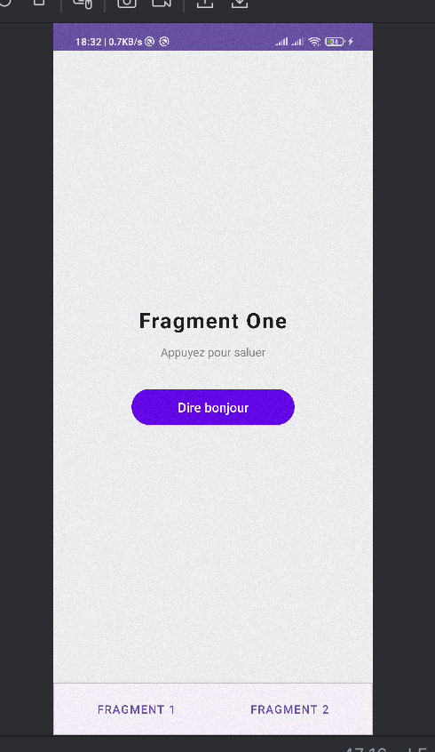
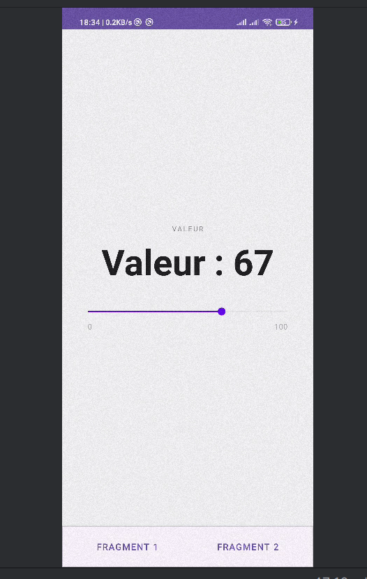

# Fragments Dynamiques en Android Java

Une application Android qui explore la creation et la navigation entre plusieurs fragments dynamiques dans une seule activite.

---

## Description

Ce lab met en pratique les fragments Android a travers deux fragments interactifs :

- **FragmentOne** : affiche un texte dynamique au clic d'un bouton
- **FragmentTwo** : contient une `SeekBar` dont la valeur est sauvegardee lors d'une rotation d'ecran
- **MainActivity** : gere la navigation entre les deux fragments via `FragmentManager`

---

## Objectifs du Lab

Comprendre et mettre en pratique :
- La creation et l'utilisation de fragments dynamiques dans une activite
- La navigation entre fragments avec `FragmentManager` et `FragmentTransaction`
- La gestion des evenements dans les fragments (`Button`, `SeekBar`)
- La sauvegarde et restauration d'etat avec `onSaveInstanceState`
- Le cycle de vie d'un fragment (`onResume`, `onPause`, etc.)

---

## Pre-requis

- **Android Studio**
- Connaissance de base des activites Android et des layouts XML
- Minimum SDK : **API 24 (Android 7.0)**

---

## Structure du Projet

```
com.example.fragmentslab/
├── MainActivity.java
├── FragmentOne.java
└── FragmentTwo.java

res/layout/
├── activity_main.xml
├── fragment_one.xml
└── fragment_two.xml
```

---

## Etape 1 — Controleur : `MainActivity.java`

```java
package com.example.fragmentslab;

import androidx.appcompat.app.AppCompatActivity;
import androidx.fragment.app.Fragment;
import androidx.fragment.app.FragmentManager;
import androidx.fragment.app.FragmentTransaction;
import android.os.Bundle;
import android.widget.Button;

public class MainActivity extends AppCompatActivity {

    private Button btn1, btn2;

    @Override
    protected void onCreate(Bundle savedInstanceState) {
        super.onCreate(savedInstanceState);
        setContentView(R.layout.activity_main);

        btn1 = findViewById(R.id.btnFragment1);
        btn2 = findViewById(R.id.btnFragment2);

        // Afficher le premier fragment au demarrage
        if (savedInstanceState == null) {
            replaceFragment(new FragmentOne(), false);
        }

        btn1.setOnClickListener(v -> replaceFragment(new FragmentOne(), true));
        btn2.setOnClickListener(v -> replaceFragment(new FragmentTwo(), true));
    }

    private void replaceFragment(Fragment fragment, boolean addToBackStack) {
        FragmentManager fm = getSupportFragmentManager();
        FragmentTransaction ft = fm.beginTransaction()
                .setReorderingAllowed(true)
                .replace(R.id.fragment_container, fragment);

        if (addToBackStack) {
            ft.addToBackStack(null);
        }

        ft.commit();
    }
}
```

**Explication des methodes cles :**

| Methode | Role |
|---|---|
| `getSupportFragmentManager()` | gere les fragments dans les activites AppCompat |
| `replace()` | remplace le contenu du conteneur par un nouveau fragment |
| `addToBackStack()` | memorise la transaction pour permettre le retour arriere |
| `commit()` | applique definitivement la transaction |

> Sans `addToBackStack`, le fragment precedent est detruit et on ne peut plus y revenir.

---

## Etape 2 — Premier Fragment : `FragmentOne.java`

```java
package com.example.fragmentslab;

import android.os.Bundle;
import androidx.annotation.NonNull;
import androidx.annotation.Nullable;
import androidx.fragment.app.Fragment;
import android.view.View;
import android.widget.Button;
import android.widget.TextView;

public class FragmentOne extends Fragment {

    private TextView tv;
    private Button btnHello;

    public FragmentOne() {
        super(R.layout.fragment_one);
    }

    @Override
    public void onViewCreated(@NonNull View view, @Nullable Bundle savedInstanceState) {
        tv = view.findViewById(R.id.textOne);
        btnHello = view.findViewById(R.id.btnHello);

        btnHello.setOnClickListener(v -> tv.setText("Bonjour depuis Fragment 1 !"));
    }
}
```

- `super(R.layout.fragment_one)` dans le constructeur definit directement le layout sans override de `onCreateView`
- `onViewCreated` est appele apres que la vue est construite — c'est ici qu'on lie les composants

---

## Etape 3 — Deuxieme Fragment : `FragmentTwo.java`

```java
package com.example.fragmentslab;

import android.os.Bundle;
import androidx.annotation.NonNull;
import androidx.annotation.Nullable;
import androidx.fragment.app.Fragment;
import android.view.View;
import android.widget.SeekBar;
import android.widget.TextView;

public class FragmentTwo extends Fragment {

    private TextView tvValue;
    private SeekBar seek;
    private int progress = 0;
    private static final String KEY_PROGRESS = "progress";

    public FragmentTwo() {
        super(R.layout.fragment_two);
    }

    @Override
    public void onViewCreated(@NonNull View view, @Nullable Bundle savedInstanceState) {
        tvValue = view.findViewById(R.id.tvValue);
        seek = view.findViewById(R.id.seekBar);

        // Restaurer l'etat apres rotation
        if (savedInstanceState != null) {
            progress = savedInstanceState.getInt(KEY_PROGRESS, 0);
            seek.setProgress(progress);
            tvValue.setText("Valeur : " + progress);
        }

        seek.setOnSeekBarChangeListener(new SeekBar.OnSeekBarChangeListener() {
            @Override public void onProgressChanged(SeekBar s, int p, boolean fromUser) {
                progress = p;
                tvValue.setText("Valeur : " + p);
            }
            @Override public void onStartTrackingTouch(SeekBar s) {}
            @Override public void onStopTrackingTouch(SeekBar s) {}
        });
    }

    @Override
    public void onSaveInstanceState(@NonNull Bundle outState) {
        super.onSaveInstanceState(outState);
        outState.putInt(KEY_PROGRESS, progress);
    }
}
```

**Gestion de l'etat lors de la rotation :**

| Methode | Role |
|---|---|
| `onSaveInstanceState` | sauvegarde la valeur de `progress` avant destruction |
| `savedInstanceState.getInt(KEY_PROGRESS, 0)` | restaure la valeur au recreement du fragment |

---

## Etape 4 — Navigation entre Fragments

Le `FrameLayout` dans `activity_main.xml` sert de conteneur vide. A chaque clic :

1. `replaceFragment()` cree une `FragmentTransaction`
2. Le fragment courant est remplace par le nouveau
3. La transaction est ajoutee a la pile de retour (`addToBackStack`)
4. `commit()` applique le changement

**Exemple de navigation :**
```
Fragment 1 affiche
  → clic bouton 2 → Fragment 2 remplace Fragment 1
  → appui Back    → retour a Fragment 1
```

---

## Etape 5 — Cycle de Vie (debug optionnel)

Ajouter dans `FragmentOne` pour observer le cycle de vie dans Logcat :

```java
@Override
public void onResume() {
    super.onResume();
    android.util.Log.d("FragmentOne", "onResume()");
}

@Override
public void onPause() {
    super.onPause();
    android.util.Log.d("FragmentOne", "onPause()");
}
```

> Observer la console **Logcat** dans Android Studio pour voir quand le fragment s'affiche et se met en pause.

---

## Concepts Cles

- **`Fragment`** — composant d'interface reutilisable avec son propre cycle de vie, integre dans une activite
- **`FragmentManager`** — gestionnaire des fragments associes a une activite
- **`FragmentTransaction`** — groupe d'operations sur les fragments (add, replace, remove)
- **`replace()` vs `add()`** — `replace` detruit le fragment precedent, `add` le conserve en dessous
- **`addToBackStack()`** — permet le retour arriere natif avec le bouton Back
- **`onSaveInstanceState`** — sauvegarde l'etat avant une rotation ou une interruption
- **`onViewCreated`** — methode privilegiee pour lier les composants XML dans un fragment

---

## Lancer le Projet

1. Cloner le depot :
   ```bash
   git clone https://github.com/votre-utilisateur/fragments-lab.git
   ```
2. Ouvrir le projet dans **Android Studio**
3. Lancer sur un emulateur ou un appareil physique (API 24+)
4. Tester la rotation d'ecran sur Fragment 2 pour verifier la sauvegarde de la SeekBar

---

## Technologies


---

## Licence

Ce projet est realise dans le cadre d'un laboratoire pedagogique.

---

## Screenshot



